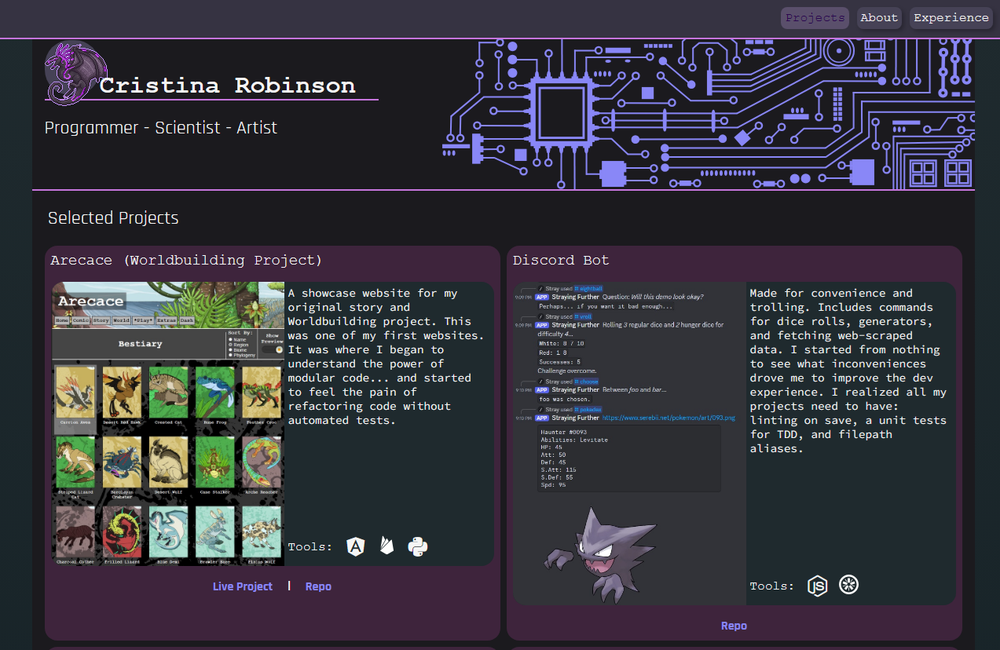

# Portfolio
The website code to display my programing portfolio online.

## Current work
I'm starting my portfolio over from scratch.  After 2.5 years in a for realz coding job, I need to refocus my content, I want to restylize, and I want to get off the horrible template I started with from bootcamp.  Bootstrap is NOT my friend.  Doing everything in base css IS my friend.

## Preview

## Live Link
https://neurobio.github.io/Portfolio/
